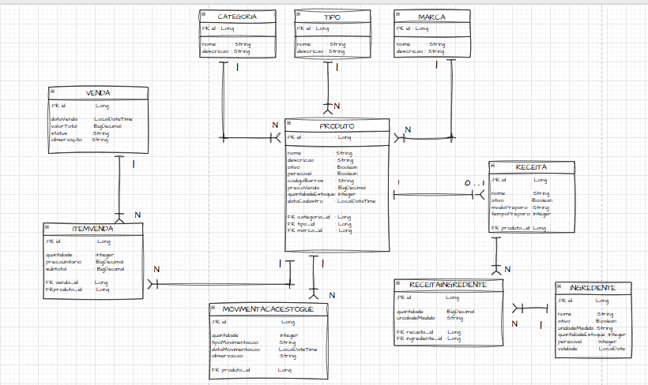

# Gesttack ERP

Sistema ERP em desenvolvimento com foco em controle de estoque, vendas e gerenciamento de produtos.

## Objetivo

O projeto foi criado para praticar conceitos reais de:

- Modelagem de banco de dados
- Arquitetura backend
- Relacionamentos SQL
- Controle transacional
- Estruturação de sistemas corporativos

---

## Tecnologias

### Banco de Dados
- PostgreSQL
- SQL

### Backend
- Java
- Spring Boot (em desenvolvimento)

### Frontend
- React (planejado)
- Angular (planejado)

---

## Funcionalidades

- Cadastro de produtos
- Controle de categorias, tipos e marcas
- Controle de estoque
- Histórico de movimentações
- Registro de vendas
- Itens de venda
- Receitas e ingredientes

---

## Modelagem Relacional

O banco foi estruturado utilizando:

- Primary Keys (PK)
- Foreign Keys (FK)
- Relacionamentos 1:1
- Relacionamentos 1:N
- Relacionamentos N:N
- Integridade referencial

---

## Estrutura do Projeto

```text
Gesttack-ERP/
 ├── database/
 ├── der/
 ├── docs/
 ├── frontend-react/
 ├── frontend-angular/
 └── README.md
```

---

## DER do Sistema



---

## Status do Projeto

- [x] Modelagem do banco
- [x] Estrutura PostgreSQL
- [x] Relacionamentos SQL
- [x] Testes com INSERT e JOIN
- [ ] Backend Spring Boot
- [ ] API REST
- [ ] Frontend

---

## Aprendizados

Durante o desenvolvimento estão sendo aplicados conceitos de:

- Banco de dados relacionais
- Integridade referencial
- Controle de estoque
- Estrutura ERP
- Arquitetura backend
- Versionamento com Git/GitHub

## DER do Sistema

Diagrama Entidade Relacionamento (DER) do banco de dados do Gesttack ERP.

